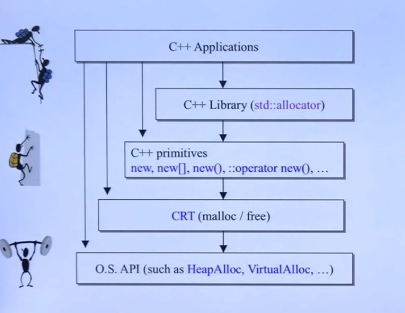

# 内存管理



## C++primitives

| 分配                        | 释放                        | 类属                  | 可否重载           |
| ------------------------- | ------------------------- | ------------------- | -------------- |
| malloc()                  | free()                    | C函数                 | 不可             |
| new                       | delete                    | C++表达式(expressions) | 不可             |
| ::operator new()          | ::operator delete()       | C++函数               | 可              |
| allocator\<T>::allocate() | allocator\<T>::deallocate | C++标准库              | 可以自由设计以之搭配任何容器 |

```c++
void * p1 = malloc(512);		// 512 bytes
free(p1);

complex<int>* p2 = new complex<int>;		// one object
delete p2;

void* p3 = ::operator new(512);		// 512 bytes
::operator delete(p3);

// 以下使用C++标准库提供的allocators。但厂商并未完全遵守标准。
#ifdef _MSC_VER
	// 以下两函数都是non-static，一定要通过object调用。以下分配3 ints
	int* p4 = allocator<int>().allocate(3, (int*)0);		// (int*)0无用
	allocator<int>().delallocate(p4, 3);
#endif
#ifdef __BORLANDC__
	// 以下两函数都是non-static，一定要通过object调用。以下分配5 ints
	int* p4 = allocator<int>().allocate(5);
	allocator<int>().deallocate(p4, 5);
#endif
#ifdef __GNUC__
	// 以下两函数都是static，可以通过全名调用。以下分配512 bytes
	void* p4 = alloc::allocate(512);
	alloc::deallocate(p4, 512);
	// 以下两函数都是non-static，一定要通过object调用。以下分配7 ints
	void* p4 = allocator<int>().allocate(7);
	allocator<int>().deallocate((int*)p4, 7);

	// 以下两函数都是non-static，一定要通过object调用。以下分配9 ints
	void* p5 = __gnu_cxx::__pool_alloc<int>().allocate(9);
	__gnu_cxx::__pool_alloc<int>().deallocate((int*)p5, 9);
#endif
```

- 7-8行其实和1-2行是一样的，7-8调用的是1-2。
- `allocator\<int>()`创建出来的临时变量，为了申请内存。
- `alloc::allocate`是旧版的写法，现在的版本改为`__gnu_cxx::__pool_alloc<int>()`

## new expression

```c++
Complex* pc = new Complex(1, 2);
||
||编译器转换为
\/
Complex *pc;
try {
[1]  void* mem = operator new(sizeof(Complex));		// allocate 分配内存
[2]  pc = static_cast<Complex*>(mem);		// cast 类型转换
[3]  pc->Complex::Complex(1, 2);		// construct 调用构造函数
}
catch(std::bad_alloc){
  // 若allocation失败就不执行constructor
}
```

- 注意：只有编译器才可以像上面那样直接呼叫ctor，欲直接调用ctor，可运用placement new: new(p) Complex(1, 2);
- `_callnewh`可以设定函数释放内存，可以在内存`malloc`失败的时候用调用。

`operator new`源代码

```c++
void *operator new(size_t size, const std::nothrow_t&)
  					_THROW0()
{
    // try to allocate size bytes
  void *p;
  while((p = malloc(size)) == 0)
  {
      // buy more memory or return null pointer
    _TRY_BEGIN
      if(_callnewh(size) == 0) break;
    _CATCH(std::bad_alloc) return(0);
    _CATCH_END
  }
  return(p);
}
```

- `const std::nothrow_t&`函数不抛异常

## delete expression

```c++
Complex* pc = new Complex(1, 2);
...
delete pc;
||
||编译器转换为
\/
[1] pc->~Complex();		// 先析构
[2] operator delete(pc);		// 然后释放内存
```

operator delete函数源代码

```c++
void __cdecl operator delete(void *p) _THROW
{
  // free an allocated object
  free(p);
}
```

- 构造函数不可以直接调用，析构函数可以直接调用

##Ctor & Dtor 直接调用

```c++
strin* pstr = new string;
cout << "str= " << *ptr << endl;

//! pstr->string::string("jjhou");
		// [Error] 'class std::basic_string<char>' has no member name string
//! pstr->~string();	// crash
	cout << "str= " << *pstr << endl;
```

- string是basic_string的typedfy

```c++
class A
{
    public:
  	int id;
  	A(int i) : id(i) { count << "ctor. this=" << this << "id=" << id << endl; }
  	~A()			{ count << "dtor. this=" << this << endl; }
};

A* pA = new A(1);		// ctor. this=000307A8 id=1
cout << pA->id << endl;		// 1
//! pA->A::A(3);		// in VC6 : ctor. this=000307A8 id=3
						// in GCC : [Error] cannot call constructor 'jj02::A::A' directly
//! A::A(5);			// in VC6 : ctor. this=0013FF60 id=5
						// in GCC : [Error] cannot call constructor directly
count << pA->id << endl;		// in VC6 : 3
								// in GCC : 1
delete pA;						// dtor. this=000307A8
```

