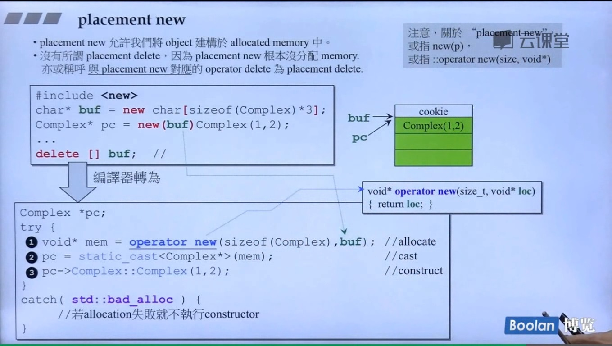
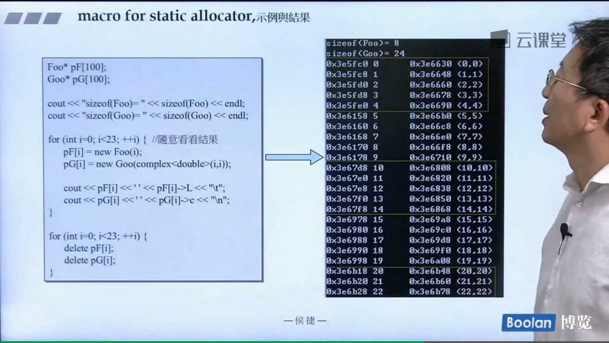
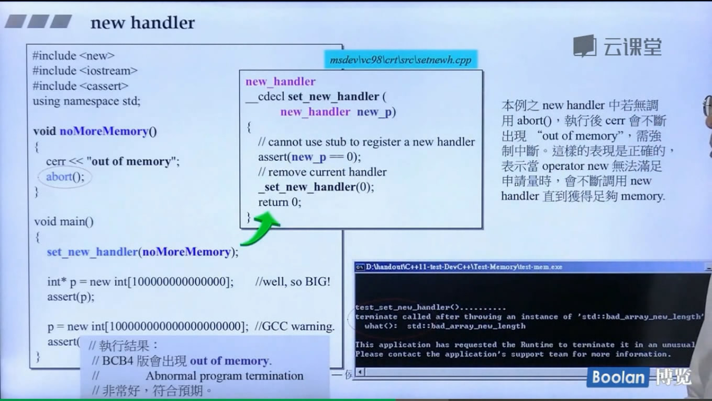
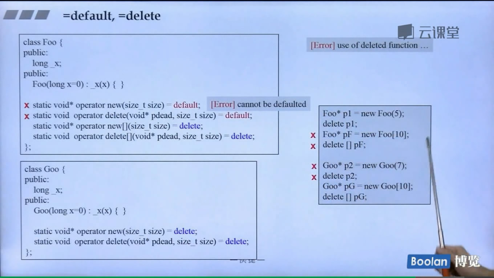
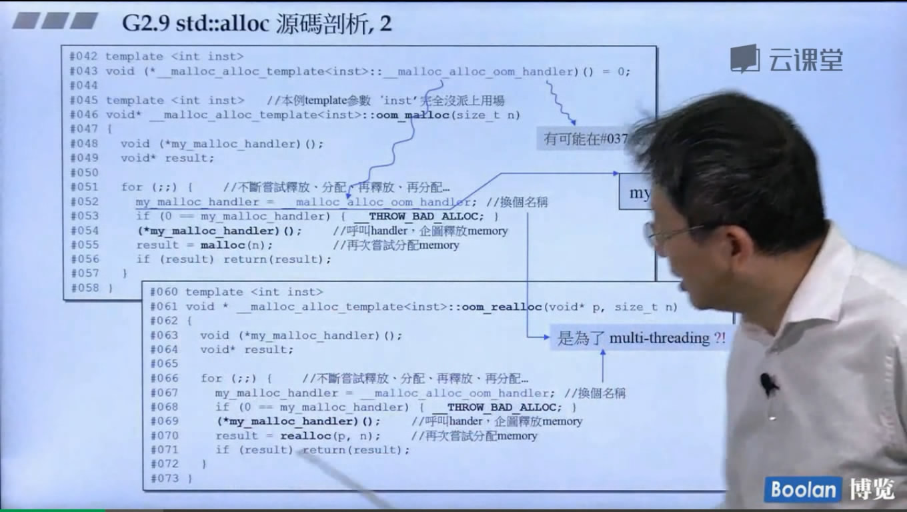
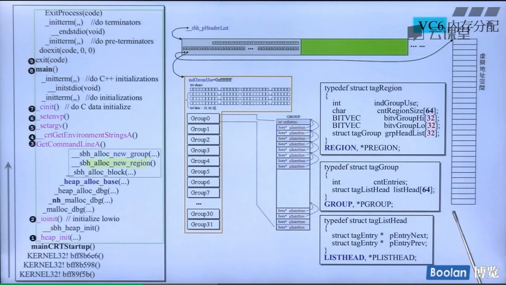

# 内存管理

[TOC]

##第一讲 primitives


### C++primitives

| 分配                        | 释放                        | 类属                  | 可否重载           |
| ------------------------- | ------------------------- | ------------------- | -------------- |
| malloc()                  | free()                    | C函数                 | 不可             |
| new                       | delete                    | C++表达式(expressions) | 不可             |
| ::operator new()          | ::operator delete()       | C++函数               | 可              |
| allocator\<T>::allocate() | allocator\<T>::deallocate | C++标准库              | 可以自由设计以之搭配任何容器 |

```c++
[1]void * p1 = malloc(512);		// 512 bytes
[2]free(p1);

complex<int>* p2 = new complex<int>;		// one object
delete p2;

[7]void* p3 = ::operator new(512);		// 512 bytes
[8]::operator delete(p3);

// 以下使用C++标准库提供的allocators。但厂商并未完全遵守标准。
#ifdef _MSC_VER
	// 以下两函数都是non-static，一定要通过object调用。以下分配3 ints
	int* p4 = allocator<int>().allocate(3, (int*)0);		// (int*)0无用
	allocator<int>().delallocate(p4, 3);
#endif
#ifdef __BORLANDC__
	// 以下两函数都是non-static，一定要通过object调用。以下分配5 ints
	int* p4 = allocator<int>().allocate(5);
	allocator<int>().deallocate(p4, 5);
#endif
#ifdef __GNUC__
	// 以下两函数都是static，可以通过全名调用。以下分配512 bytes
	void* p4 = alloc::allocate(512);
	alloc::deallocate(p4, 512);
	// 以下两函数都是non-static，一定要通过object调用。以下分配7 ints
	void* p4 = allocator<int>().allocate(7);
	allocator<int>().deallocate((int*)p4, 7);

	// 以下两函数都是non-static，一定要通过object调用。以下分配9 ints
	void* p5 = __gnu_cxx::__pool_alloc<int>().allocate(9);
	__gnu_cxx::__pool_alloc<int>().deallocate((int*)p5, 9);
#endif
```

- 7-8行其实和1-2行是一样的，7-8调用的是1-2。
- `allocator\<int>()`创建出来的临时变量，为了申请内存。
- `alloc::allocate`是旧版的写法，现在的版本改为`__gnu_cxx::__pool_alloc<int>()`

### new expression

```c++
Complex* pc = new Complex(1, 2);
||
||编译器转换为
\/
Complex *pc;
try {
[1]  void* mem = operator new(sizeof(Complex));		// allocate 分配内存
[2]  pc = static_cast<Complex*>(mem);		// cast 类型转换
[3]  pc->Complex::Complex(1, 2);		// construct 调用构造函数
}
catch(std::bad_alloc){
  // 若allocation失败就不执行constructor
}
```

- 注意：只有编译器才可以像上面那样直接呼叫ctor，欲直接调用ctor，可运用placement new: new(p) Complex(1, 2);
- `_callnewh`可以设定函数释放内存，可以在内存`malloc`失败的时候用调用。

`operator new`源代码

```c++
void *operator new(size_t size, const std::nothrow_t&)
  					_THROW0()
{
    // try to allocate size bytes
  void *p;
  while((p = malloc(size)) == 0)
  {
      // buy more memory or return null pointer
    _TRY_BEGIN
      if(_callnewh(size) == 0) break;
    _CATCH(std::bad_alloc) return(0);
    _CATCH_END
  }
  return(p);
}
```

- `const std::nothrow_t&`函数不抛异常

### delete expression

```c++
Complex* pc = new Complex(1, 2);
...
delete pc;
||
||编译器转换为
\/
[1] pc->~Complex();		// 先析构
[2] operator delete(pc);		// 然后释放内存
```

operator delete函数源代码

```c++
void __cdecl operator delete(void *p) _THROW
{
  // free an allocated object
  free(p);
}
```

- 只有编译器可以调用构造函数
- 构造函数不可以直接调用，析构函数可以直接调用

###Ctor & Dtor 直接调用

ctor/dtor == constructor and destructor

```c++
strin* pstr = new string;
cout << "str= " << *ptr << endl;

//! pstr->string::string("jjhou");
		// [Error] 'class std::basic_string<char>' has no member name string
//! pstr->~string();	// crash
	cout << "str= " << *pstr << endl;
```

- string是basic_string的typedef

```c++
class A
{
    public:
  	int id;
  	A(int i) : id(i) { count << "ctor. this=" << this << "id=" << id << endl; }
  	~A()			{ count << "dtor. this=" << this << endl; }
};

A* pA = new A(1);		// ctor. this=000307A8 id=1
cout << pA->id << endl;		// 1
//! pA->A::A(3);		// in VC6 : ctor. this=000307A8 id=3
						// in GCC : [Error] cannot call constructor 'jj02::A::A' directly
//! A::A(5);			// in VC6 : ctor. this=0013FF60 id=5
						// in GCC : [Error] cannot call constructor directly
count << pA->id << endl;		// in VC6 : 3
								// in GCC : 1
delete pA;						// dtor. this=000307A8
```

### array new,array delete

```C++
Complex* pca = new Complex[3];
// 唤起三次ctor
// 无法即由参数给予初值
...
delete[] pca;		// 唤起3次dtor
```


- cookie簿子记录，包含指针的长度。用于free内存用


- `new(tmp++)`在已经分配的内存上new，定点的new
- **次序逆反**

### array size, in memory block


- `61h`cookie
- Pad(12 bytes)是填充的部分，为了成为16的倍数
- 这里int，delete,delete[]都是一样的


### placement new

- placement new 允许我们将object建构于allocated memory中
- `没有所谓的placement delete`，因为placement new 根本没分配memory。也有人称呼与placement new对应的operator delete 为placement delete



::operator new(size, void*)源代码

```c++
void* operator new(size_t, void* loc)
{ return lock;}
```

- placement new是指`new(p)`或者`::operator new(size, void*)`
- operator new(size_t, void* loc)传入loc，传回也是loc。什么都没做。

### C++应用程序，分配内存的途径

> 9重载


- 重载的作用，可以去除内存cookie部分。节省空间，加快速度


### 重载::operator new / ::operator delete


- operator new和operator delete必须是静态的，编译器自动会设置，可以不写。因为这两个方法是类的方法，如果想不通过对象来调用，就需要改为静态的。


### 重载示例

> 10.重载示例（上）


```c++
class Foo
{
  public:
  	int _id;
  	long _data;
  	string _str;
  
  public:
  	Foo() : _id(0) {cout << "default ctor.this=" << this << "id=" << endl;}
  	Foo() : _id(i) {cout << "ctor.this=" << this << "id=" << _id << endl;}
  
  //virtual
  	~Foo()	{cout << "dtor.this=" << this << "id=" << _id << endl;}
  static void* operator new(size_t size);
  static void operator delete(void* pdead, size_t size);
  static void* operator new[](size_t size);
  static void operator delete[](void* pdead, size_t size);
};

void* Foo::operator new(size_t size){
    Foo* p= (Foo *)malloc(size);
  	cout << ......
    return p;
}
void* Foo::operator delete(void* pdead, size_t size){
  	cout << ......
    free(pdead);
}
void* Foo::operator new[](size_t size){
    Foo* p= (Foo *)malloc(size);
  	cout << ......
    return p;
}
void* Foo::operator delete[](void* pdead, size_t size){
  	cout << ......
    free(pdead);
}
```


- 有带Virtual的类会比没有Virtual的类大小更大些


- 全局重载并没有进入重写的new/delete函数

> 11.重载示例（下）


重载new，带参数的例子：


### Per-class allocator

> 12.Per-class allocator

内存管理的两个目标

1. 可以降低malloc的次数，可以提高速度。
2. 减少cookie用量，减少占用容量。


- 类中添加一个单向链表


- cookie是8字节，新修改的内存是连续的，每块都是8个字节。而没有修改的间隔是16个字节。

###Per-class allocator 2

> 13.Per-class allocator 2


- delete并没有把内存释放，还给操作系统。
- `union{AirplaneRep rep; Airplane *next;};`是嵌入式指针。不存AirplaneRep数据时，存next指针。如果要使用的时候，空出来存数据。
- 在 C++ 我们可以选择使联合(union)匿名。如果我们将一个 union 包括在一个结构(structure)的定义中，并且不赋予它对象(object)名称 (就是跟在花括号{}后面的名字)，这个union 就是匿名的。这种情况下我们可以直接使用 union 中元素的名字来访问该元素，而不需要再在前面加 union 对象的名称。


### Static allocator

> 14 Static allocator


- 因为allocator myAlloc是静态的，所以要在外头定义allocator Foo/Goo::myAlloc。


### Macro for static allocator

> 15 Macro for static allocator.mp4


- 使用macro改善写代码




### New Handler

> 16.NewHandler.mp4


设计良好的new handler只有两个选择：

- 让更多的memory可用
- 调用abort()或exit()



- 如果写new handler要记得退出


- 拷贝构造，拷贝复制，析构函数有默认函数。
- =default表示函数是默认版本 



## 第二讲 std::allocator

> VC6 malloc().mp4

[00_02_59][20171113-211000-0].JPG)

- 希望去除cookie

### VC6标准分配器之实现

> 18.VC6标准分配器之实现.mp4


### BC5标准分配器之实现

> 19. BC5标准分配器之实现.mp4


- 去除cookie的先决条件是，分配内存都是一样大小（因为cookie存储的是内存大小）。

### G2.9标准分配器之实现

> 20.G2.9标准分配器之实现.mp4


- 不要使用这个文件
- 任何标准库中都没使用这个分配器


- 标准容器使用的是**std::alloc**

### G2.9std_allocVSG4.9__pull_alloc

> 21.G2.9std_allocVSG4.9__pull_alloc.mp4


### G4.9pull_alloc用例

> 22.G4.9pull_alloc用例.mp4


- **__pool_alloc**分配器没有cookie
- **std::allocator**分配器有cookie

西北有高楼

### std alloc

> 23 G2.9 std alloc.mp4


- 超过16种大小的时候，alloc会调用malloc来分配内存。这时候就会啊带cookie。
- free_list[16]存放16种不同存储大小内存的指针，每条间隔八个字节。8字节，16字节，24字节。
- 容器申请内存的时候会自动调整到8的边界。
- 3号会分配2*20个32bytes，20个自己用，20个未分配（战备池）。再分配7号的时候，会利用这个空间。


### std_alloc运行一瞥

> 24.G2.9std_alloc运行一瞥01-05.mp4


- 战备池是start_free和end_free之间的位置。
- RoundUp是追加量，会越来越大。
- 上面的小方块是cookie，pool是蓝色方块部分。


- 小方块是cookie，直线是一整块的。

### std_alloc运行一瞥11-13

> 26.G2.9std_alloc运行一瞥11-13.mp4


- 24的内存(碎片)挂到#2，24/8-1 = 2
- 从右边的内存中找。剪断9号的链表。9号变为空的。


### std_alloc源码剖析（上）

> 27.G2.9std__alloc源码剖析（上）.mp4


- 分配器分两级，第二级失败了调用第一级，用newhandler




- 一个换肤工程，将分配的字节改为元素大小


- \# 94-#96都是常量


- 从单用户来看，分配的资源不会还给操作系统，不会有太大问题。

### G2.9std_alloc源码剖析(中)

> 28.G2.9std_alloc源码剖析（中）.mp4


### G2.9std_alloc源码剖析（下）.mp4

> 29.G2.9std_alloc源码剖析（下）.mp4


### G2.9 std::alloc观念 大整理

> 30.G2.9 std::alloc 观念大整理.mp4

大整理


- list是链表，除了类的数据之外还有两个链表。
- Foo(1)是栈上的，new Foo(2)的是堆上的。


- 指针要分开写
- 把变量放到后面
- 变量在用的时候在定义
- 不赞成炫技的合并写法


### G4.9pull allocator运行观察

> 31.G4.9pull allocator运行观察.mp4


- alias template模板挂名

###G2.9 std::alloc移植到C


## 第三讲 malloc/free

胸中自有丘壑

> VC6内存分配


> SBH之始- \_heap_init()和\_sbh_heap_init()

###SBH之始- \_heap_init()和\_sbh_heap_init()

> 32.VC6和VC10的malloc比较.mp4


- 分配16个HEADER


### VC6内存分配(1)

> 33.VC6内存分配(1).mp4


- nSize = 32 *8=256
- **_CrtMemBlockHeader**是在debug模式下附加到申请内存上的部分
- **lRequest**记录的是流水号
- nNoManLand无人区
- Block是包括附加内容的全部分配大小，真正割出去的大小。_heap_alloc_dbg是调整大小


### VC6内存分配(2)

> 34.VC6内存分配（2）.mp4


- _bNoMansLandFill填充**0xFD**真正数据区域上下的gap
- _bDeadLandFill填充**0xDD**未初始化的栈内容
- _bCleanLandFill填充**0xCD**未初始化的堆内容


- 1016需要加上上下两个cookie（8字节）刚好1024


- 2*sizeof(int)是上下cookie
- cookie的**131**记录的分配Block总空间大小**130**，因为和16位对齐，分配出去内存最后一位一定是0。这时候借用这一位来记录内存回收用。**1表示占用，0表示可以还给SBH(系统)。**

### VC6内存分配（3）

> 35.VC6内存分配(3).mp4



- **16个header**，串成一个链，每个header管理**1MegaByte**
- 一个指针指向内存（最右侧的一列），一个指向管理中心（左边的一列）总共16K

### VC6内存分配（4）

> 36.VC6内存分配（4）.mp4


- 4K是一个Page
- 16是一个Paragraphs
- GetEnviromentStringsA()获取环境变量


- 4080是两个0xffffffff之间的大小（实际是4096-8=4088 调整到16倍数是4080，保留8）。
- 最后一条链表管理大于1K的内存，目前八个page都大于1K（4080）所以管理全部。

###VC6内存分配（5）

> 37.VC6内存分配（5）.mp4


- 如果程序出了main的最后一个}，还存在NORMAL_BLOCK的区块，则表示存在内存泄漏。

### 38.SBH行为-分配+释放之连续动作图解(1)

> 38.SBH行为-分配+释放之连续动作图解(1).mp4


- 如果指针进入无人区（fdfdfdfd）调试器就发出警报
- 小区块0000001显示的挂载内存的指针，32*64


- indGroupUse表示分配出去的次数

###SBH行为分析-分配+释放之连续动作图解（2）

> 39.SBH行为分析-分配+释放之连续动作图解（2）.mp4


### SBH行为分析-分配+释放之连续动作图解（3）

> 40.SBH行为分析-分配+释放之连续动作图解（3）.mp4


### SBH行为分析-分配+释放之连续动作图解（4）

> 41.SBH行为分析-分配+释放之连续动作图解（4）.mp4


- Group0并没有完全用完，而是Group0剩下的部分不够分配了。 

## 第四讲 lok::allocator 

## 第五讲 other allocators

